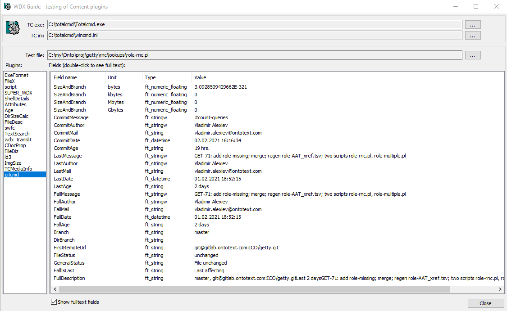

# WDX_GitCommander
Git plugin for Total Commander!
(WDX, that means column information and mouseover hints over a repository or a file in repository.)


Dear guys! This project is aimed to try to compile libgit2 and making a plugin for Total Commander.
It should work without git back-end and without the git tools in the path (that's why I compiled libgit2 anyway). 

To use the plugin - download the released archive and set it up in Total Commander.
(It should be sufficient just to open the zip in Total Commander, for everything else there is http://totalcmd.net/plugring/tc_plugman.html)

The easiest way to use is to create your own columns, I suggest just replacing the original Size column with the column "SizeAndBranch".
Because that will show the branch instead of `<DIR>` for directories (what I personally wanted while creating the plugin).

In the future I would like to make it with better installators and so. If you love Total Commander, feel free to do it faster than me.

Martin.

PS: Thread on the Total Commander site: http://www.ghisler.ch/board/viewtopic.php?t=42074

## Mouseover Hints

For like GitHub functionality in Total Commander, there is the possibility to create plugin-defined hints in Total Commander.
Just go to Configuration->Display and down there on the setting page tick some boxes with "hint texts" to make visible the small button with "+".
Then it just remains to add a rule for all files "*" with this formatting:

Option **a) Last commit info**
```
[=gitcmd.Branch] ([=gitcmd.CommitAge]) [=gitcmd.FirstRemoteUrl]\n[=gitcmd.CommitMessage]\n[=gitcmd.CommitAuthor] [=gitcmd.CommitMail] [=gitcmd.CommitDate.D.M.Y h:m:s]
```

Option **b) Last commit affecting given file**
(or last commit info for folders)
```
[=gitcmd.Branch] [=gitcmd.FirstRemoteUrl]\n[=gitcmd.FallIsLast] [=gitcmd.FallAge]\n[=gitcmd.FallMessage]\n[=gitcmd.FallAuthor] [=gitcmd.FallMail] [=gitcmd.FallDate.D.M.Y h:m:s]\n[=gitcmd.GeneralStatus]
```

Option **c) Full description**
Consisting of branch and first remote URL for folders, additional commit info for files
```
[="Git: "gitcmd.FullDescription]
```

## Fields Provided, Using WDX Guide

To see what fields are provided by `WDX_GitCommander`, you can use [WDX Guide](http://totalcmd.net/plugring/wdx_guide2.html).
It's a separate executable that you can put on the toolbar. When you step on a file, WDX Guide lets you select any WDX plugin and shows all fields provided by that plugin, and their current values:



You see 3 groups of fields with the following meaning:
- `Commit*`: the latest commit that we checked out for this repo (global)
- `Last*`: the latest commit that affected the current file (local) OR empty.
  - This is similar to [git blame](https://linuxhint.com/git_blame/) but at file level, not line level.
- `Fall*`: "fallthrough" commit: the latest that affected the current file (local), OR the current commit (global)
  - There's also a flag `FallIsLast`, which says whether the fallthrough commit is "Last affecting", or the global 
